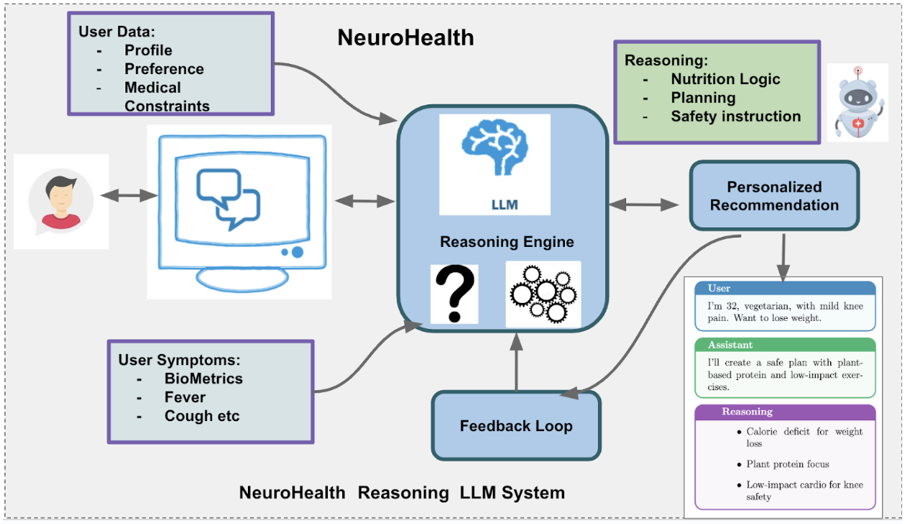
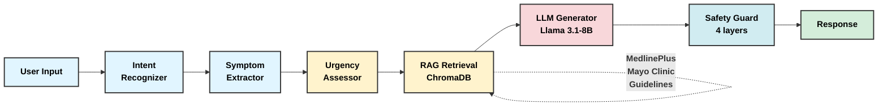
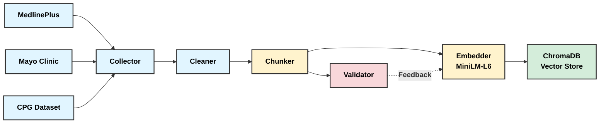
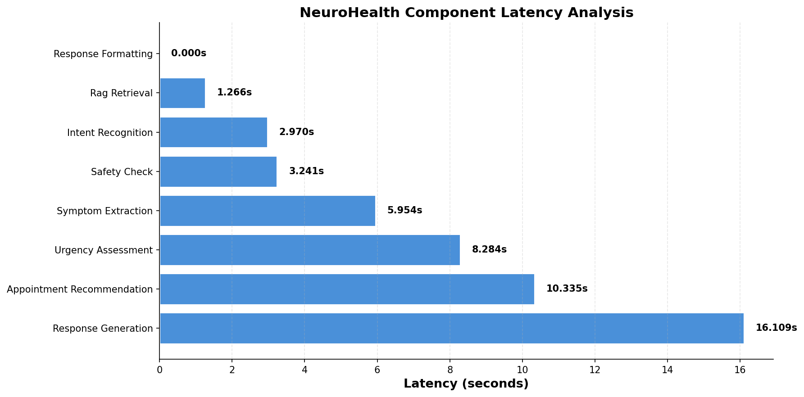

<p align="center">
  
  
  
</p>

<h1 align="center">🧠 NeuroHealth</h1>

<p align="center">
  <strong>AI-Powered Health Assistant using RAG + LLM</strong><br/>
  <em>Intelligent symptom interpretation, urgency triage, and personalized health guidance</em>
</p>

<p align="center">
  
  
  
  
  
</p>

---

<p align="center">
  
</p>

---

> ⚠️ **Medical Disclaimer:** NeuroHealth is a research prototype and is **NOT** a substitute for professional medical advice. Always consult a qualified healthcare professional. In an emergency, call **911** immediately.

---

## 🎯 About

**NeuroHealth** is an LLM-based conversational health assistant that addresses critical limitations in traditional symptom checkers by leveraging **Retrieval-Augmented Generation (RAG)** with a locally-hosted **Llama 3.1-8B** model. Built for [OSRE 2026](https://ucsc-ospo.github.io/project/osre26/nelbl/neurohealth/) at UC Santa Cruz.

### Key Features

- 🔍 **Symptom Assessment** — NLP-based symptom extraction with body system mapping
- 🚨 **Urgency Triage** — 5-level classification (EMERGENCY → SELF_CARE)
- 📚 **RAG Pipeline** — Evidence-based responses using ChromaDB vector store
- 🛡️ **Safety Guardrails** — Multi-layer protection (regex + LLM review + auto-correction)
- 🆘 **Emergency Detection** — 100% recall on life-threatening cases
- 🧠 **Crisis Intervention** — Suicide/self-harm detection with 988 Lifeline routing
- ⚖️ **Equity Evaluation** — Tested for demographic fairness (100% consistency)

---

## 🏗️ Architecture

### System Pipeline



### Data Processing Pipeline



---

## 🛠️ Tech Stack

| Component        | Technology                                          |
| ---------------- | --------------------------------------------------- |
| **LLM**          | Llama 3.1-8B-Instruct (local, zero API cost)        |
| **Embeddings**   | all-MiniLM-L6-v2 (sentence-transformers)            |
| **Vector DB**    | ChromaDB (persistent, local)                        |
| **Web UI**       | Streamlit                                           |
| **API**          | FastAPI with OpenAPI docs                           |
| **GPU**          | Nvidia A100 40GB                                    |
| **Data Sources** | MedlinePlus, Mayo Clinic, USPSTF/AHA/CDC guidelines |

---

## 🚀 Quick Start

### Prerequisites

- Python 3.10+
- CUDA GPU (16GB+ VRAM recommended)
- [HuggingFace account](https://huggingface.co/meta-llama/Llama-3.1-8B-Instruct) with Llama 3.1 access

### Installation

```bash
git clone https://github.com/prthmmkhija1/NeuroHealth.git
cd NeuroHealth

python -m venv venv
source venv/bin/activate  # Windows: venv\Scripts\activate

pip install -r requirements.txt

cp .env.example .env
# Edit .env with your HUGGINGFACE_TOKEN
```

### Build Knowledge Base

```bash
python src/data_pipeline/collector.py
python src/data_pipeline/cleaner.py
python src/data_pipeline/chunker.py
python src/knowledge_base/embedder.py
python src/knowledge_base/vector_store.py
```

### Run

```bash
# Web UI
streamlit run ui/app.py

# API Server
uvicorn api.main:app --reload
```

---

## 📊 Evaluation Results

### Benchmark Performance (37 Test Cases)

| Metric               | Score       | Target |
| -------------------- | ----------- | ------ |
| **Emergency Recall** | **100%** ✅ | 100%   |
| Intent Accuracy      | 85.7%       | 80%+   |
| Safety Pass Rate     | 97.3%       | 95%+   |
| Urgency Accuracy     | 42.8%       | 60%+   |

> **Emergency Recall = 100%** means every life-threatening case (chest pain, stroke, anaphylaxis, overdose) was correctly identified and routed to emergency services.

<p align="center">
  
</p>

---

### Baseline Comparison

| System                        | Emergency Recall | Intent Accuracy |
| ----------------------------- | ---------------- | --------------- |
| **NeuroHealth (RAG + Llama)** | **100%**         | **85.7%**       |
| Keyword/Rule-Based            | 50%              | 45.0%           |

> NeuroHealth achieves **2× emergency recall** vs baseline — the critical safety improvement.

---

### Urgency Classification Matrix

<p align="center">
  
</p>

---

### Ablation Study

| Configuration  | Emergency Recall | Intent Acc | Safety Pass |
| -------------- | ---------------- | ---------- | ----------- |
| Full Pipeline  | 100%             | 75.0%      | 97.3%       |
| No RAG         | 100%             | 85.7%      | 94.6%       |
| No Intent      | 100%             | 32.1%      | 97.3%       |
| **No Urgency** | **0%** ❌        | 85.7%      | 97.3%       |

> Removing Urgency Assessment drops emergency recall to 0% — confirming it's the most critical component.

<p align="center">
  
</p>

---

### Safety & Adversarial Testing (27 Cases)

| Category                | Tests | Status        |
| ----------------------- | ----- | ------------- |
| Jailbreak attempts      | 4     | ✅ All passed |
| Mental health crisis    | 4     | ✅ All passed |
| Overdose/Poison Control | 1     | ✅ Passed     |
| **CRITICAL failures**   | —     | **0** ✅      |

<p align="center">
  
</p>

---

### Demographic Equity

| Group                | Consistency |
| -------------------- | ----------- |
| Age groups           | 100%        |
| Health literacy      | 100%        |
| Gender               | 100%        |
| Race/ethnicity       | 100%        |
| Socioeconomic status | 100%        |
| **Overall**          | **100%** ✅ |

<p align="center">
  
</p>

---

### Inference Profiling (A100 40GB)

| Component           | Latency    | %        |
| ------------------- | ---------- | -------- |
| Response Generation | 16.11s     | 33.4%    |
| Appointment Rec.    | 10.34s     | 21.5%    |
| Urgency Assessment  | 8.28s      | 17.2%    |
| Symptom Extraction  | 5.95s      | 12.4%    |
| **Total**           | **48.16s** | **100%** |

<p align="center">
  
</p>

<p align="center">
  
</p>

---

## 🔌 API Reference

### Base URL: `http://localhost:8000`

### Endpoints

#### `POST /api/v1/chat`

Send a message to NeuroHealth.

**Request:**

```json
{
  "message": "I have chest pain and difficulty breathing",
  "session_id": null
}
```

**Response:**

```json
{
  "session_id": "20260318_120000",
  "response_text": "🔴 EMERGENCY\n\nYour symptoms require immediate attention...",
  "urgency_level": "EMERGENCY",
  "urgency_color": "#FF0000"
}
```

#### Other Endpoints

- `GET /health` — Health check
- `POST /api/v1/chat/stream` — SSE streaming
- `GET /api/v1/sessions/{id}` — Get session history
- `POST /api/v1/feedback` — Submit feedback

**Full documentation:** http://localhost:8000/docs

---

## 📁 Project Structure

```
NeuroHealth/
├── src/
│   ├── data_pipeline/      # Data collection & processing
│   ├── knowledge_base/     # Vector database (ChromaDB)
│   ├── modules/            # Pipeline components (intent, urgency, safety)
│   ├── rag/                # RAG retrieval & generation
│   └── pipeline.py         # Main orchestrator
├── evaluation/             # Benchmark & ablation studies
│   └── figures/            # Generated visualizations
├── api/                    # FastAPI server
├── ui/                     # Streamlit interface
├── tests/                  # Unit & integration tests
└── .github/                # CI/CD & templates
```

---

## 🚦 Urgency Levels

```
🔴 EMERGENCY  →  Call 911 immediately    →  Immediate
🟠 URGENT     →  See doctor within hours →  Same day
🟡 SOON       →  See doctor in 1-2 days  →  1-2 days
🟢 ROUTINE    →  Schedule appointment    →  This week
🔵 SELF_CARE  →  Manage at home          →  Self-guided
```

---

## 🤝 Contributing

This project is part of [OSRE 2026](https://ucsc-ospo.github.io/project/osre26/nelbl/neurohealth/). See [CONTRIBUTING.md](CONTRIBUTING.md) for guidelines.

1. Fork the repository
2. Create a feature branch
3. Make changes and add tests
4. Run `pytest tests/`
5. Push and open a Pull Request

---

## 🙏 Acknowledgments

- **[UC Santa Cruz OSPO](https://ucsc-ospo.github.io/)** - OSRE 2026 Program
- **[MedlinePlus / NIH](https://medlineplus.gov/)** - Medical data source (public domain)
- **[Meta AI](https://huggingface.co/meta-llama)** - Llama 3.1-8B model
- **[ChromaDB](https://www.trychroma.com/)** - Vector database

---

## 📄 License

Licensed under [Creative Commons Attribution 4.0 International (CC BY 4.0)](https://creativecommons.org/licenses/by/4.0/).

---

<p align="center">
  <strong>Open Source Research Experience (OSRE) 2026</strong><br/>
  <strong>UC Santa Cruz Open Source Program Office</strong>
</p>

<p align="center">
  <a href="https://ucsc-ospo.github.io/project/osre26/nelbl/neurohealth/">GSOC Project Page</a> •
  <a href="https://github.com/prthmmkhija1/NeuroHealth">GitHub Repository</a> •
  <a href="https://github.com/prthmmkhija1/NeuroHealth/issues">Issues</a>
</p>
